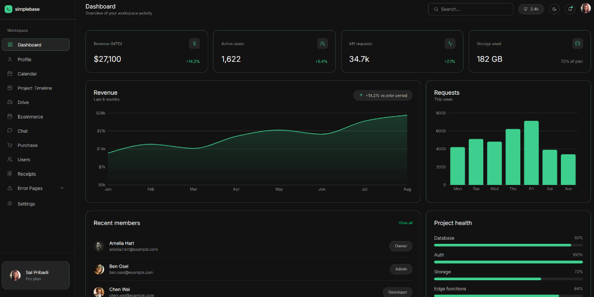
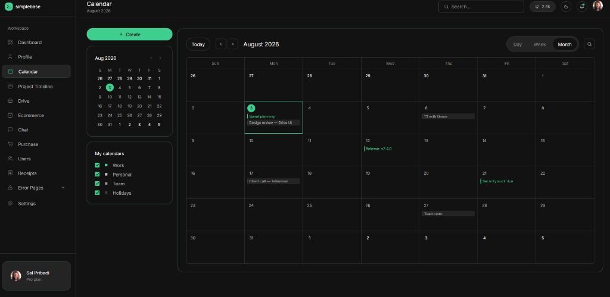
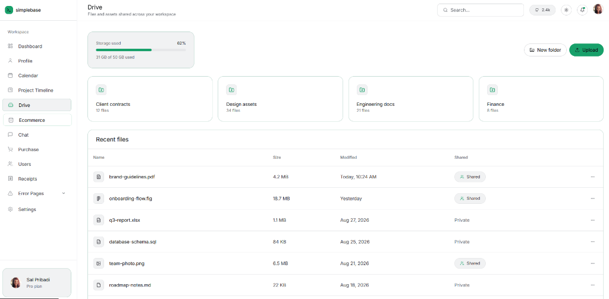
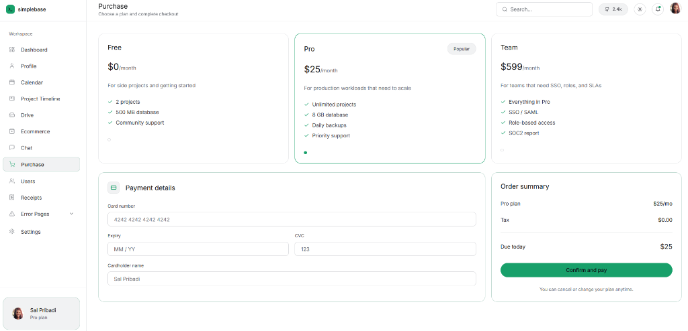
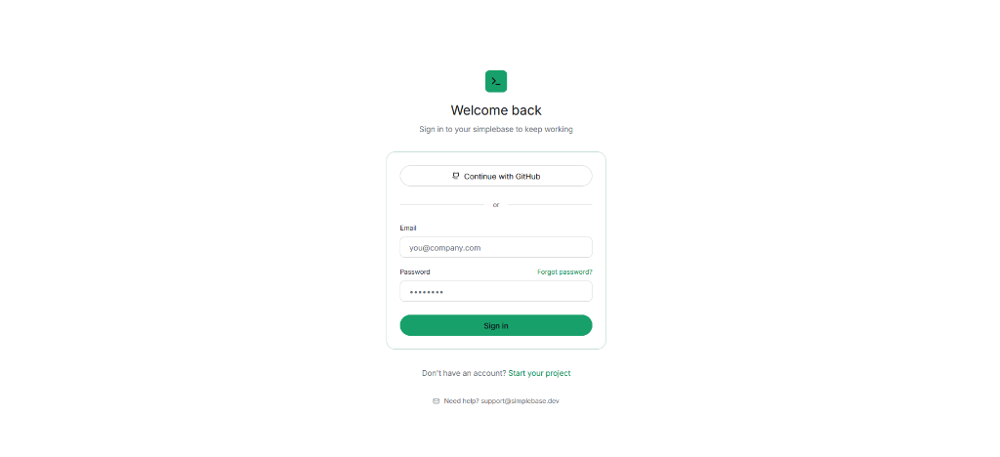

# Simplebase — Admin Dashboard Template

A modern, responsive, and minimalist admin dashboard template built with **Next.js 14** (App Router), **TypeScript**, and **Tailwind CSS**. It is styled to match a clean and dark-canvas aesthetic with a focus on simplicity and ease of use.

## Features & Screenshots

### Dashboard
Overview of workspace activity, revenue charts, and project health metrics.


### Calendar
Manage upcoming events, meetings, and project milestones.


### Drive
File manager interface for client contracts, design assets, and shared files.


### Purchase
Subscription plan selection and checkout flow.


### Login
Simple and secure sign-in page.


## Dependencies

This template leverages the following core technologies and libraries:

- **Next.js** (`14.2.35`): React framework with App Router support.
- **React** (`^18`): Core library for building the UI components.
- **Tailwind CSS** (`^3.4.1`): Utility-first CSS framework for rapid UI styling.
- **Lucide React** (`^0.383.0`): Beautiful and consistent icon set used throughout the dashboard.
- **Recharts** (`^2.12.7`): A composable charting library built on React components for the dashboard charts.
- **TypeScript** (`^5`): Strongly typed programming language that builds on JavaScript.

## How to Run Locally (Tutorial)

Follow these steps to get a local development environment up and running:

### 1. Prerequisites
Ensure you have [Node.js](https://nodejs.org/) installed on your machine. We recommend using Node.js v18 or later.

### 2. Install Dependencies
Open your terminal, navigate to the project directory, and run the following command to install all required npm packages:

```bash
npm install
```

### 3. Start the Development Server
Once the installation is complete, start the local development server by running:

```bash
npm run dev
```

### 4. View the App
Open your web browser and navigate to:
[http://localhost:3000](http://localhost:3000)

- The root URL automatically redirects to the `/dashboard`.
- To see the login screen, navigate to `/login`.
- You can navigate through other pages (Calendar, Drive, Ecommerce, Marketplace, Settings, etc.) using the left sidebar.

## Project Structure

- `src/app`: Contains all Next.js App Router pages and layouts.
- `src/components`: Reusable UI components (Sidebar, StatCard, ThemeProvider, etc.).
- `src/lib`: Utility functions and mock data (`data.ts`).
- `tailwind.config.ts`: Tailwind configuration, custom colors, and design tokens.

## Notes
- All data presented in the dashboard is currently mocked in `src/lib/data.ts`. You can wire up your own database or API there.
- The project supports light and dark themes (managed by `ThemeProvider` and CSS variables).
